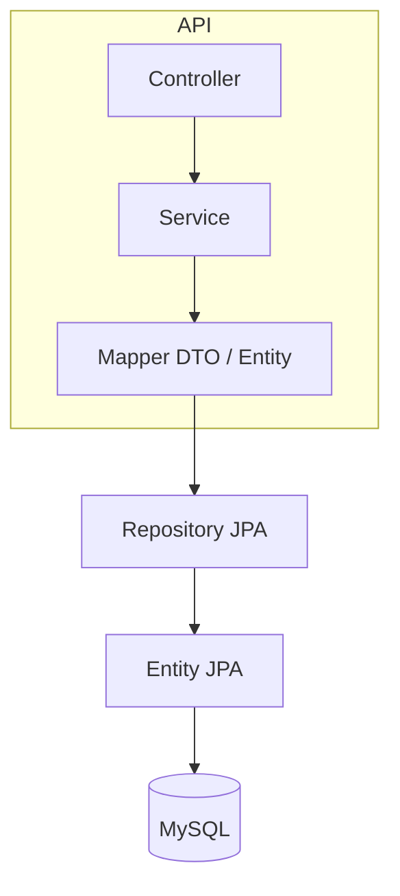

# Architecture — gestion_salles

## Objectif

API **REST** **Spring Boot** pour la gestion de **salles** et **réunions** : réservation, critères de recherche, documentation OpenAPI.

## Couches (Spring)

| Élément | Rôle |
|---------|------|
| `controller/` | Contrats HTTP, délégation au service |
| `service/` + `service/imp/` | Logique métier |
| `mapper/` | Transformation **Entity** ↔ **DTO** |
| `repository/` | Spring Data JPA |
| `entity/` | Modèle persistant |
| `dto/` | Objets exposés API |
| `exception/` | Erreurs métier |
| `enums/` | Types énumérés métier |

## Configuration

- `application.properties` : datasource, JPA, Springdoc.
- Point d’entrée : `GestionSallesApplication`.

## Principes

- **Controller mince** : pas de logique métier lourde.
- **DTO** en entrée/sortie API pour découpler le modèle interne des contrats HTTP.
